# WJPr

WJPr is an R package developed to streamline data analysis and
visualization for the Data Analytics Unit at The World Justice Project
(WJP). This package includes essential data and tools for replicating
visualizations from WJP Country Reports and analyzing Rule of Law Index
scores.

## Features

**Version 1.0.0** of WJPr offers:

- A wide range of visualization functions to recreate WJP Country Report
  charts, such as bar plots, line graphs, and radar charts.
- Access to Rule of Law Index scores data, including detailed
  information for all factors and subfactors.
- Streamlined tools for generating publication-ready graphics.

## Installation

WJPr is hosted on GitHub. To install the package, ensure you have the
`devtools` package installed and use the following commands:

``` r
# Install WJPr from GitHub
devtools::install_github("worldjusticeproject-org/WJPr")
```

## Usage

Load the package into your R session:

``` r
library(WJPr)
```

### Example: Accessing Rule of Law Index Data

The package provides built-in datasets for analysis:

``` r
# View the first few rows of the dataset
head(WJPr::roli)
```

### Example: Creating a Visualization

Here is an example of how to use WJPr to create a bar chart:

``` r
# Always load the WJP fonts if not passing a custom theme to function
wjp_fonts()

# Loading data
gpp_data <- WJPr::gpp

# Prepare the data
data4bars <- gpp_data %>%
  select(country, year, q1a) %>%
  group_by(country, year) %>%
  mutate(
    q1a = as.double(q1a),
    trust = case_when(
      q1a <= 2  ~ 1,
      q1a <= 4  ~ 0,
      q1a == 99 ~ NA_real_
    ),
    year = as.character(year)
  ) %>%
  summarise(
    trust   = mean(trust, na.rm = TRUE),
    .groups = "keep"
  ) %>%
  mutate(
    trust = trust*100
  ) %>%
  filter(year == "2022")

# Draw the chart
wjp_bars(
    data4bars,              
    target    = "trust",        
    grouping  = "country",
    colors    = "year",
    cvec      = c("2022" = "#8789C0")
)
```

## Chart Gallery

WJPr provides 12 chart types for creating publication-ready
visualizations:

|                                                                                                |                                                                                                |                                                                                                |
|:----------------------------------------------------------------------------------------------:|:----------------------------------------------------------------------------------------------:|:----------------------------------------------------------------------------------------------:|
|                                         **Bar Chart**                                          |                                         **Dots Chart**                                         |                                         **Line Chart**                                         |
|               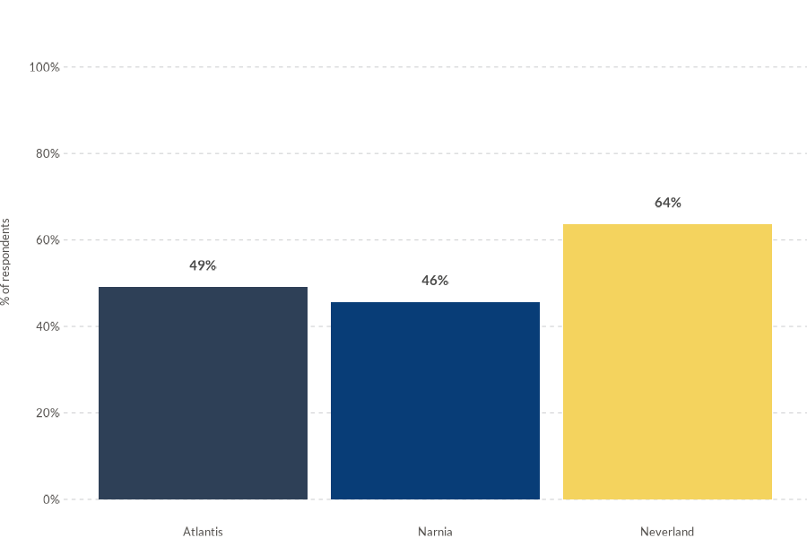                |                    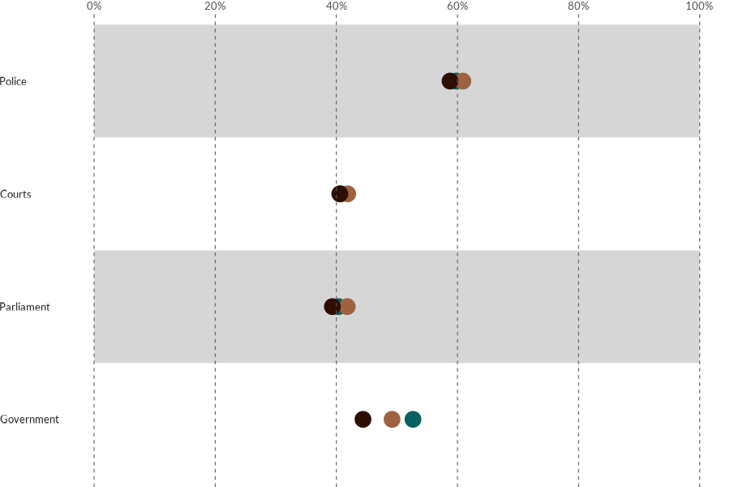                    |                   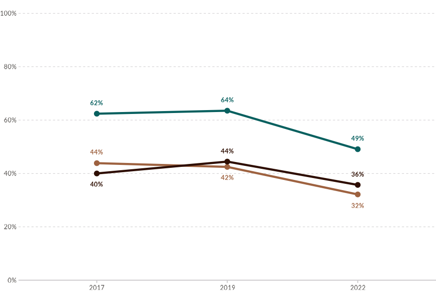                   |
|      [`wjp_bars()`](https://worldjusticeproject-org.github.io/WJPr/reference/wjp_bars.md)      |      [`wjp_dots()`](https://worldjusticeproject-org.github.io/WJPr/reference/wjp_dots.md)      |     [`wjp_lines()`](https://worldjusticeproject-org.github.io/WJPr/reference/wjp_lines.md)     |
|                                       **Diverging Bars**                                       |                                         **Dumbbells**                                          |                                        **Slope Chart**                                         |
|             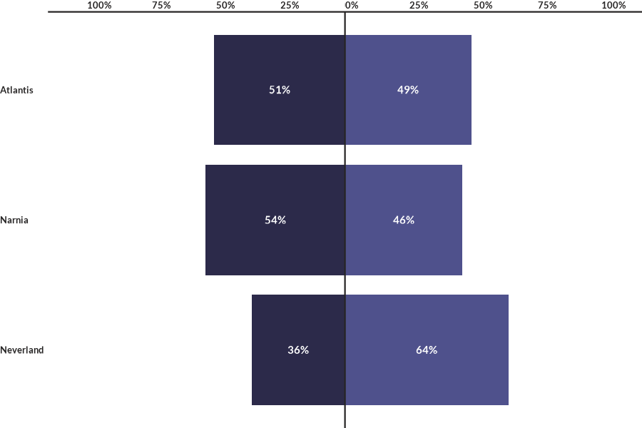              |               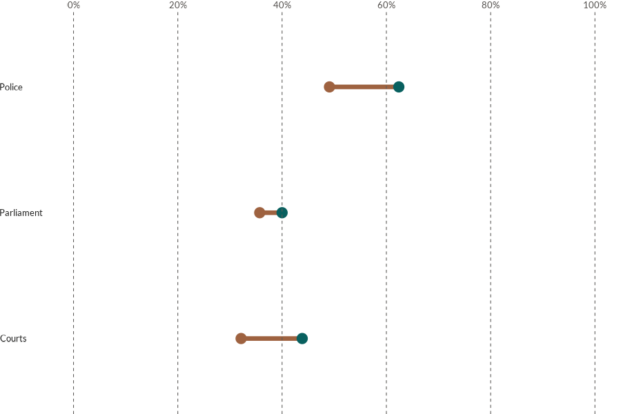               |                  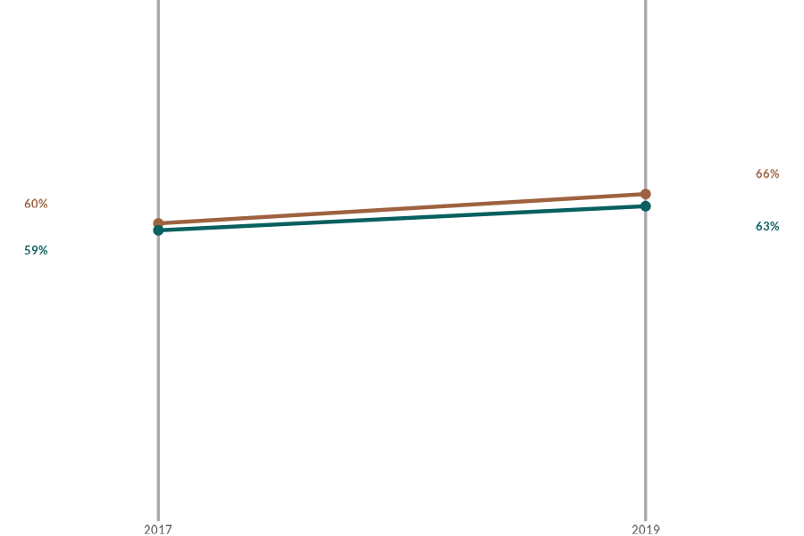                   |
|   [`wjp_divbars()`](https://worldjusticeproject-org.github.io/WJPr/reference/wjp_divbars.md)   | [`wjp_dumbbells()`](https://worldjusticeproject-org.github.io/WJPr/reference/wjp_dumbbells.md) |     [`wjp_slope()`](https://worldjusticeproject-org.github.io/WJPr/reference/wjp_slope.md)     |
|                                        **Radar Chart**                                         |                                         **Rose Chart**                                         |                                        **Gauge Chart**                                         |
|                  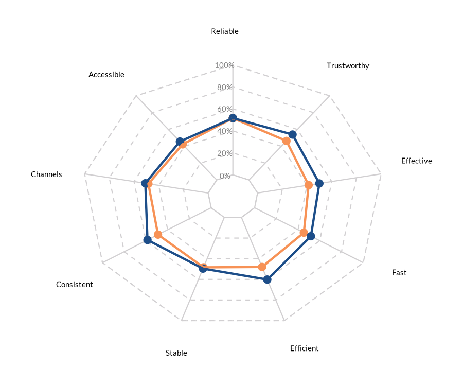                   |                   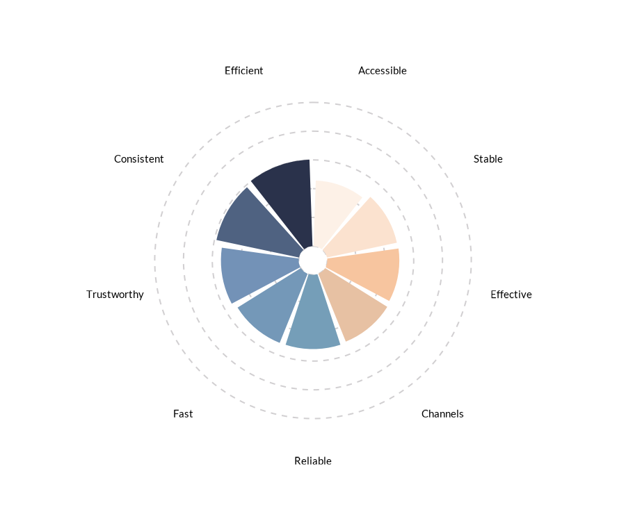                    |                  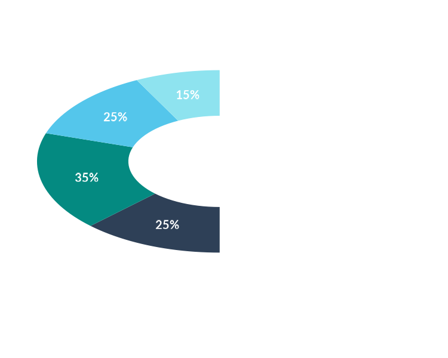                   |
|     [`wjp_radar()`](https://worldjusticeproject-org.github.io/WJPr/reference/wjp_radar.md)     |      [`wjp_rose()`](https://worldjusticeproject-org.github.io/WJPr/reference/wjp_rose.md)      |     [`wjp_gauge()`](https://worldjusticeproject-org.github.io/WJPr/reference/wjp_gauge.md)     |
|                                       **Lollipop Chart**                                       |                                          **Edgebars**                                          |                                        **Grouped Bars**                                        |
|               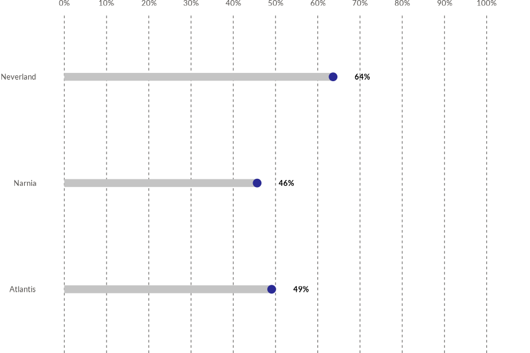               |               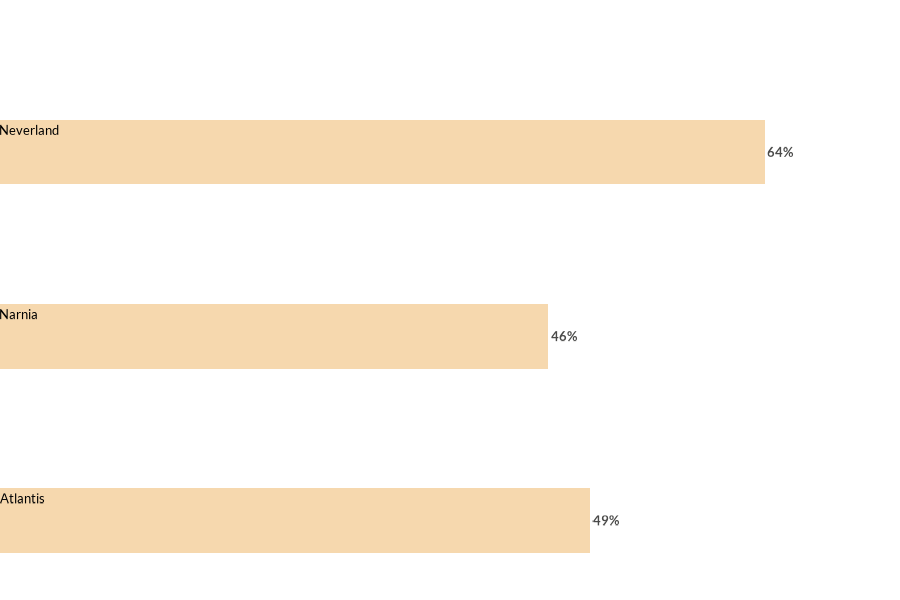                |             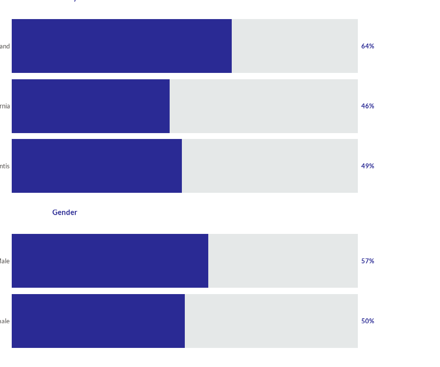              |
| [`wjp_lollipops()`](https://worldjusticeproject-org.github.io/WJPr/reference/wjp_lollipops.md) |  [`wjp_edgebars()`](https://worldjusticeproject-org.github.io/WJPr/reference/wjp_edgebars.md)  | [`wjp_groupbars()`](https://worldjusticeproject-org.github.io/WJPr/reference/wjp_groupbars.md) |

For a complete interactive gallery with code examples, see the [Chart
Gallery
vignette](https://worldjusticeproject-org.github.io/WJPr/articles/gallery.html).

## Data Structure

All WJPr visualization functions expect data in **long (tidy) format**:

    | grouping     | target | colors   | labels (optional) |
    |--------------|--------|----------|-------------------|
    | Category A   | 45.2   | Group 1  | "45%"             |
    | Category B   | 32.1   | Group 1  | "32%"             |
    | Category A   | 51.0   | Group 2  | "51%"             |
    | Category B   | 38.5   | Group 2  | "39%"             |

**Key parameters used across all functions:**

| Parameter  | Description                           | Type              |
|------------|---------------------------------------|-------------------|
| `target`   | Values to plot (Y-axis)               | Numeric column    |
| `grouping` | Categories (X-axis or rows)           | Character/Factor  |
| `colors`   | Variable for color grouping           | Character/Factor  |
| `cvec`     | Named vector mapping values to colors | `c("A" = "#HEX")` |
| `labels`   | Text labels to display                | Character column  |

### Validate Your Data

Use
[`wjp_check_data()`](https://worldjusticeproject-org.github.io/WJPr/reference/wjp_check_data.md)
to verify your data structure before plotting:

``` r
wjp_check_data(
  data     = my_data,
  type     = "bars",
  target   = "value",
  grouping = "category",
  colors   = "group",
  cvec     = c("Group 1" = "#2E4057", "Group 2" = "#F4D35E")
)
```

For detailed guidance, see the [Data Preparation
vignette](https://worldjusticeproject-org.github.io/WJPr/articles/data-preparation.html).

## Documentation

Comprehensive documentation is available for all functions and datasets.
Use the R help system to access it:

``` r
?WJPr::wjp_lines
```

## Contributing

Contributions are welcome! Before contributing, please read our
guidelines:

### Quick Start

1.  Fork the repository
2.  Create a feature branch: `git checkout -b feature/new-chart`
3.  Follow the coding conventions in
    [CONTRIBUTING.md](https://worldjusticeproject-org.github.io/WJPr/CONTRIBUTING.md)
4.  Submit a pull request

### Adding New Functions

All visualization functions must follow the WJPr patterns:

``` r
wjp_newchart <- function(
    data,
    target,
    grouping,
    colors    = NULL,
    cvec      = NULL,
    labels    = NULL,
    ptheme    = WJP_theme()
) {
  # 1. Rename columns using all_of()
  # 2. Handle NULL parameters
  # 3. Create ggplot
  # 4. Apply colors if cvec provided
  # 5. Apply theme
  return(plt)
}
```

### Documentation Requirements

- Roxygen2 with `@export`, `@param`, `@return`, `@examples`
- Include `lifecycle::badge("experimental")` in description
- Add example to `data-raw/generate-examples.R`
- Update `CLAUDE.md`

### Resources

- **[CONTRIBUTING.md](https://worldjusticeproject-org.github.io/WJPr/CONTRIBUTING.md)** -
  Complete contribution guidelines
- **[Development
  Guide](https://worldjusticeproject-org.github.io/WJPr/articles/development-guide.html)** -
  Step-by-step tutorial
- **[Issues](https://github.com/worldjusticeproject-org/WJPr/issues)** -
  Report bugs or request features

## License

This project is licensed under the MIT License. See the `LICENSE.md`
file for details.

## Acknowledgments

WJPr was developed by the Data Analytics Unit at The World Justice
Project. Special thanks to the whole team for their invaluable input in
creating this package.
